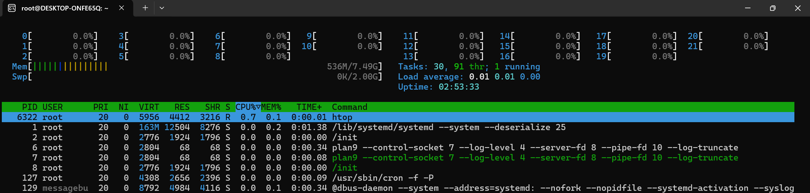
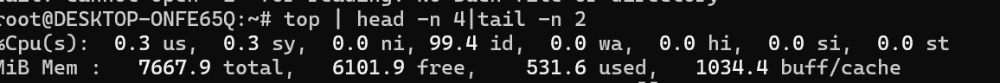

## 1. System Monitoring
### Install and configure monitoring tools: htop or nmon


```bash
sudo apt update
sudo apt install htop nmon -y
```

### Script: `monitor_du.sh`

This script logs:
- Disk usage (`df -h`)
- Home directory usage (`du -sh`)
- Top 10 CPU-consuming processes  (` ps command I have used  Or top also we can use | htop is interactive tool and hard to  script ` )
- Top 10 memory-consuming processes ( `ps` )

**Log files are saved in:**  
`~/system_monitor/system_info_<YYYY-MM-DD>.log`

#### Usage

```bash
sh monitor_du.sh
```

#### Automate with Cron

To run the script every 10 min, add to your crontab:

```bash
crontab -e
```


```
Add:
```
*/10 * * * * /bin/bash /path/to/monitor_du.sh   
```

---
#### Output log file:


### htop output:


### top output:
